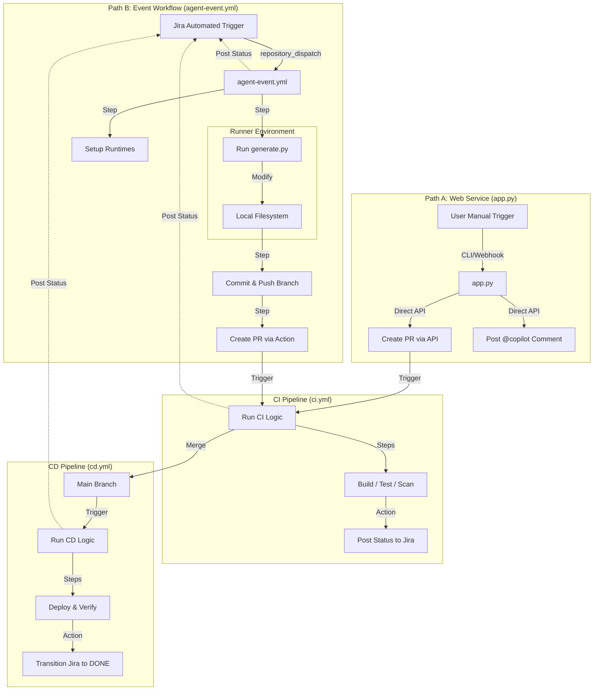

# Copilot Agent & Jira Integration

Automates CI/CD workflow creation and code fixing in GitHub based on Jira tickets. This project provides a two-fold solution:
1.  **Copilot Agent Service (`app.py`)**: A persistent FastAPI service handling webhooks and manual triggers to create CI pipelines and auto-fixes.
2.  **Jira Integrated Workflows**: A set of GitHub Actions workflows (`agent-event.yml`, `ci.yml`, `cd.yml`) that drive the development lifecycle with granular status reporting back to Jira.

## Project Structure

```
copilot_agent/
├─ app.py                  # Main web service (FastAPI)
├─ generate.py             # Agent worker script (moved to lib/ or used by workflow)
├─ requirements.txt
├─ lib/
│  ├─ workflow_factory.py
│  ├─ github.py
│  ├─ jira.py
│  └─ generate.py          # Agent Logic for Event Workflow
.github/
├─ scripts/
│  └─ jira.js              # Helper for Jira commenting in Actions
├─ workflows/
│  ├─ agent-event.yml      # The "Event Workflow" (Agent run)
│  ├─ ci.yml               # The "CI Workflow" (PR checks)
│  └─ cd.yml               # The "CD Workflow" (Deploy & Done)
```

## Environment Variables

Set these in your environment, `.env` file, or GitHub Repository Secrets:

```bash
GITHUB_TOKEN=<your-github-token>
# For Jira Integration
JIRA_BASE_URL=https://yourtenant.atlassian.net
JIRA_USER_EMAIL=automation-bot@yourcompany.com
JIRA_API_TOKEN=<jira-api-token>
# For CD
AZURE_WEBAPP_PUBLISH_PROFILE=<xml-profile> 
```

## Workflows and Jira Comments

This project implements a strict feedback loop where GitHub Actions post specific status updates to Jira.

### 1. Event Workflow (`agent-event.yml`)
Triggered by `repository_dispatch` (Event: `jira-webhook`).
- **Steps**:
    - Triggered -> "GitHub automation triggered for {ISSUE_KEY}."
    - Runtime Setup -> "Runtime environment ready..."
    - Agent Run (`lib/generate.py`) -> "Copilot Agent processed request..."
    - Branch Create -> "Branch created: feature/{ISSUE_KEY}."
    - PR Create -> "Pull Request created: {PR_LINK}."

### 2. CI Workflow (`ci.yml`)
Triggered by `pull_request`.
- **Steps**:
    - Checkout -> "CI pipeline started..."
    - Build/Test/Lint -> "Build completed...", "All unit tests passed."
    - Security -> "Security scan passed..."
    - Summary -> "CI completed — Build/Test/Security: All Passed."

### 3. CD Workflow (`cd.yml`)
Triggered by `push` to `main`.
- **Steps**:
    - Checkout -> "PR merged — starting deployment pipeline."
    - Deploy -> "Deployment succeeded: {DEPLOY_URL}."
    - Smoke Tests -> "Smoke tests passed..."
    - Summary -> "Deployment finished..." -> **Transitions Issue to DONE**.

## Running the Web Service (`app.py`)

For the "Classic" Webhook interactions (creating CI pipelines via JIRA button):

```bash
pip install -r requirements.txt
uvicorn app:app --reload --port 3000
```

### Endpoints
- `POST /webhook`: Generates CI workflows.
- `POST /autofix`: Applies patches to code.
- `POST /issues`: Lists Jira tickets.
- `POST /transition`: Moves Jira tickets.

### CLI Usage
Run the agent locally to pick a ticket and apply fixes:
```bash
python -m copilot_agent.app --list
```

## Mermaid Flowchart


